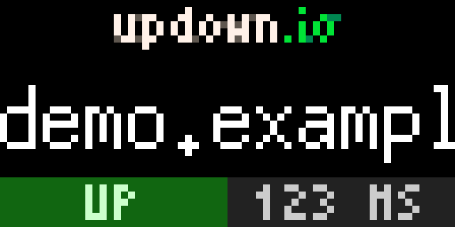

# updown.io for Tidbyt

[updown.io](https://updown.io) checks your website's status by periodically sending an HTTP request to the URL of your choice and notifies you when your website is not responding correctly. [Tidbyt](https://tidbyt.com) is a retro-style display that lets you keep up with the things you care about, like real time sports, transit, finance and more.

How'd you like to have your updown.io checks on your Tidbyt?

Done ✅

This project is a copy of the [updownio directory](https://github.com/tidbyt/community/tree/main/apps/updownio) in the [Tidbyt Community Apps repository](https://github.com/tidbyt/community).

The gifs in this directory are included as examples of the up and down screens. The gifs in the updownio directory are the original source files that have been base64 encoded and included in [updownio.star](updownio/updownio.star) as `LOGO_UP_IMG` and `LOGO_DOWN_IMG`.

If you find yourself asking "what is this .star file??", it's the [Starlark language](https://github.com/bazelbuild/starlark/blob/master/spec.md) whose syntax is a dialect of Python 🐍
